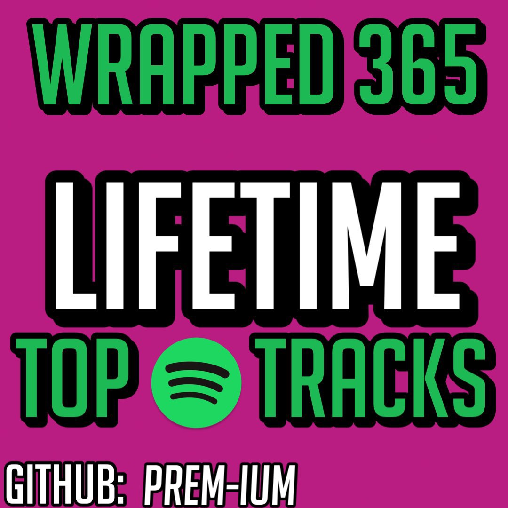

<p align="right"><a href="https://developer.spotify.com/dashboard"></a></p>
<h1 align="center"> 🎧 Spotify Wrapped 365 🎶 </h1>
<p align="right"> 
        <a href="https://github.com/sponsors/Prem-ium" target="_blank">
        </a>
</p>
<p align="center">View your Spotify <i>Top Tracks</i> in a Playlist, <i>Top Played Artists, & More</i>!</p>


## Features
- Generate Top Tracks Playlist that auto-updates!
- Generate List of Top Played Artists
- Generate Reccomended Tracks Playlists (Optional)
- Optional Apprise Alerts/Notifications
- Docker Support
- Google Sheets Compatiable. 
- Keep_Alive Flask Server

## Environment Variables
To run this project, you will need to add the following environment variables to your .env file (see .env.example for a reference):
##### Required .env:
| Environment Variable   | Description                                                                                                            | Default Value |
|------------------------|------------------------------------------------------------------------------------------------------------------------|---------------|
| `CLIENT_ID`            | Found on Spotify Developer Dashboard. [More Info](https://developer.spotify.com/dashboard/)                           | -             |
| `SECRET_CLIENT_ID`     | Found on Spotify Developer Dashboard. [More Info](https://developer.spotify.com/dashboard/)                           | -             |
| `REDIRECT_URL`         | The Redirect URL you added when creating the App on Spotify's Developer Dashboard. Check .env.example for reference. | -             |
| `USERNAME`             | Your Spotify account username (can be found in Spotify account settings.)                                             | -             |

##### Optional .env:
| Environment Variable   | Description                                                                                                            | Default Value                      |
|------------------------|------------------------------------------------------------------------------------------------------------------------|------------------------------------|
| `MINUTES`              | Number of minutes the program should wait before updating Top Tracks playlist.                                       | 360 minutes (or 6 hours)           |
| `PUBLIC_PLAYLIST`      | Boolean value indicating whether to create a public playlist.                                                         | True                               |
| `RECOMMENDATIONS`      | Boolean value indicating whether to generate recommendations (tracks playlist and artists recommendations).          | False                              |
| `KEEP_ALIVE`           | Whether to run the flask server or not to keep the program from sleeping on replit.                                  | False                              |
| `APPRISE_ALERTS`       | Full list of services and their URLs available here: [Apprise Wiki](https://github.com/caronc/apprise/wiki)          | -                                  |
| `TZ`                   | Your desired Time-Zone. Should be formatted from the IANA TZ Database.                                               | `America/New York`                 |
| `GSPREAD_KEYS`         | Your Google Service Account JSON contents obtained via OAuth 2.0 Client ID in Credentials of Google Cloud API.       | -                                  |

## Setup

### Spotify Developer Credentials (Required)
1. Go to [Spotify Developer's Dashboard](https://developer.spotify.com/dashboard). Log in using your Spotify credentials.
2. Create a new Application. Name it as desired, add any description, and agree to the Terms of Service.
3. Click on 'Edit Settings' and add the redirect URL you've set in your `.env` file, then save. Examples:

   

4. Click 'Show Client Secret'.
5. Copy/paste the Client ID into `CLIENT_ID` and the Secret Client ID into `SECRET_CLIENT_ID` within your `.env` file.

   

### Google Sheets/GSpread (Optional)
1. Sign into the [Google Cloud Console](https://console.cloud.google.com), create your APP, and enable Google Sheets and Google Drive APIs.
2. Go to API & Services -> Credentials -> Create Credentials -> Service Account. Follow the prompts and download the JSON file afterward.
3. Open Google Sheets and create a new file named 'Wrapped365'. Add tabs named 'short_term', 'medium_term', 'long_term', 'short_term Artists', 'medium_term Artists', and 'long_term Artists'.
4. Share the Google Sheet Document with the email of your service account, giving editor permissions. The email can be found in Google's Cloud Console Credentials or within the downloaded JSON file, resembling something like: `wrapped-test@wrapped-test943892.iam.gserviceaccount.com`.

## Installation
This script can be used locally or using Docker.
### Python
Clone the repository & Install dependencies
```bash
  git clone https://github.com/Prem-ium/Spotify-Wrapped-365.git
  cd Spotify-Wrapped-365
  pip install -r requirements.txt
```
Finally, you're ready to run the script!
```bash
  python main.py
```
### Docker
1. Run script locally with Python & generate cache file.
2. Download and install Docker on your system
3. Configure your `.env` file (See below and example for options)
4. 
   To build the image, cd into the repository and run:
   ```sh
   docker build -t spotify-wrapped .
   ```
   Then start the bot with:
   ```sh
   docker run -it --env-file ./.env --restart unless-stopped --name spotify-wrapped spotify-wrapped
   ```


5. Let the bot log in and begin working. DO NOT PRESS `CTRL-c`. This will kill the container and the bot. To exit the logs view, press `CTRL-p` then `CTRL-q`. This will exit the logs view but let the bot keep running.

## License
This repository is using the [MIT](https://choosealicense.com/licenses/mit/) license.

### Issues
- GitHub Actions Support (Currently Not Working-> ISSUE: Spotipy Access token is able to be refreshed, but cannot be updated to GitHub Secrets for next run)

## Donations
I've been working on this project for a few months now, and I'm really happy with how it's turned out. It's also been a helpful tool for users to view their music data.
If you appreciate my work and would like to show your support, there are two convenient ways to make a donation:

1. **GitHub Sponsors**
   - [Donate via GitHub Sponsors](https://github.com/sponsors/Prem-ium)
   - This is the preferred donation method as you can place donations with no transaction fees & possibily receive perks for your donation.
   - [](https://github.com/sponsors/Prem-ium)

2. **Buy Me A Coffee**
   - [Donate via Buy Me A Coffee](https://www.buymeacoffee.com/prem.ium)
   - [](https://www.buymeacoffee.com/prem.ium)

Your generous donations will go a long way in helping me cover the expenses associated with developing new features and promoting the project to a wider audience. I extend my heartfelt gratitude to all those who have already contributed. Thank you for your support!

## 🎧 What I've been listening to

[](https://open.spotify.com/playlist/41FgHkzQ2wf4v8MtoITL77?si=c4c016d8bdbf411a)   [](https://open.spotify.com/playlist/657cuGMmf1CnJEeMhfwgnK?si=154abf33ddd64a20)  [](https://open.spotify.com/playlist/42TRuidms91LuMajAIu5xI?si=8a22e2ccb6b9445f)

