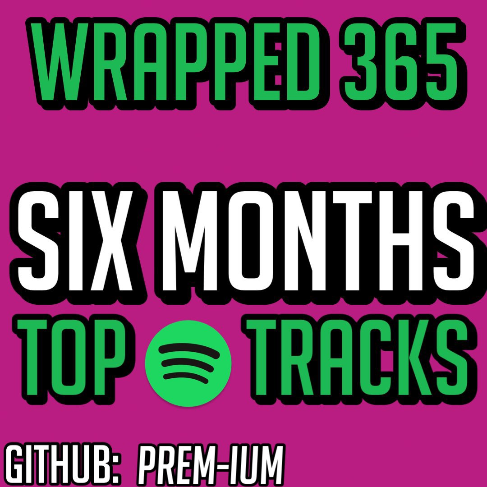

<h1 align="center">
  🎧 Spotify Wrapped 365 🎶
</h1>

<p align="center">
  View your Spotify <i>Top Tracks</i> in a Playlist, <i>Top Played Artists, & More</i>!
</p>

<p align="right">
        <a href="https://developer.spotify.com/dashboard">
    
  </a>
  
  <a href="https://github.com/sponsors/Prem-ium" target="_blank">
    
  </a>
</p>

<p align="center">
  
</p>

---
## Features
- Generate Top Tracks Playlist that auto-updates!
- Generate List of Top Played Artists
- ~~Generate Reccomended Tracks Playlists~~ (API Endpoint Depreciated)
- Optional Apprise Alerts/Notifications
- Docker Support
- Google Sheets Compatiable. 
- Keep_Alive Flask Server

---
## Environment Variables
To run this project, you will need to add the following environment variables to your .env file (see .env.example for a reference):
### Required .env

| Environment Variable   | Description                                                                                                            |
|------------------------|------------------------------------------------------------------------------------------------------------------------|
| `CLIENT_ID`            | Found on [Spotify Developer Dashboard](https://developer.spotify.com/dashboard/).                                      |
| `SECRET_CLIENT_ID`     | Found on [Spotify Developer Dashboard](https://developer.spotify.com/dashboard/).                                      |
| `REDIRECT_URL`         | The Redirect URL you added when creating the App on Spotify's Developer Dashboard. Check `.env.example` for reference. |
| `USERNAME`             | Your Spotify account username (can be found in Spotify account settings).                                             |

### Optional Environment Variables:
| Environment Variable   | Description                                                                                                            | Default Value                        |
|------------------------|------------------------------------------------------------------------------------------------------------------------|--------------------------------------|
| `MINUTES`              | The number of minutes to wait before updating the Top Tracks playlist.                                                   | `360` (or 6 hours)                  |
| `PUBLIC_PLAYLIST`      | Determines whether to create a public playlist. Accepts boolean values (`True`/`False`).                                 | `True`                               |
| `KEEP_ALIVE`           | Whether to keep the Flask server running to prevent the program from sleeping on Replit. Accepts boolean values (`True`/`False`). | `False`                              |
| `APPRISE_ALERTS`       | List of services and URLs for notifications. For more information, visit the [Apprise Wiki](https://github.com/caronc/apprise/wiki). | Not set                              |
| `TZ`                   | The desired time zone, formatted according to the IANA Time Zone Database.                                              | `America/New_York`                   |
| `AUTH_CACHE`           | A cached JSON string retrieved during initial setup, useful for hosting 24/7 on platforms like Render or other free hosting providers. | Not set                              |
| `GSPREAD_KEYS`         | Google Service Account JSON obtained via OAuth 2.0 Client ID from the Google Cloud API Credentials.                    | Not set                              |


---
## Setup

### Spotify Developer Credentials (Required)
1. Visit the [Spotify Developer Dashboard](https://developer.spotify.com/dashboard) and log in with your Spotify credentials.
2. Create a new application. Choose a name, provide a description (optional), and accept the Terms of Service.
3. In the 'Edit Settings' section, add the redirect URL from your `.env` file, then save. Example:
   
   

4. Click 'Show Client Secret'.
5. Copy the Client ID and paste it into the `CLIENT_ID` field in your `.env` file. Similarly, copy the Client Secret and paste it into the `SECRET_CLIENT_ID` field.

   


### Google Sheets/GSpread (Optional)
1. Log in to the [Google Cloud Console](https://console.cloud.google.com), create a new project, and enable the Google Sheets and Google Drive APIs.
2. Navigate to **API & Services > Credentials**, then click **Create Credentials > Service Account**. Follow the prompts and download the resulting JSON file.
3. In Google Sheets, create a new file named 'Wrapped365'. Add the following tabs: `short_term`, `medium_term`, `long_term`, `short_term Artists`, `medium_term Artists`, `long_term Artists`.
4. Share the Google Sheet with the service account’s email (found in the downloaded JSON file or under the Google Cloud Console **Credentials** section). Grant it **Editor** permissions. The email will look like: `wrapped-test@wrapped-test943892.iam.gserviceaccount.com`.

---
## Installation
This script can be used locally or using Docker.
### Python
Clone the repository & Install dependencies
```bash
  git clone https://github.com/Prem-ium/Spotify-Wrapped-365.git
  cd Spotify-Wrapped-365
  pip install -r requirements.txt
```
Finally, you're ready to run the script!
```bash
  python main.py
```
### Docker
1. Run script locally with Python & generate cache file.
2. Download and install Docker on your system
3. Configure your `.env` file (See below and example for options)
4. 
   To build the image, cd into the repository and run:
   ```sh
   docker build -t spotify-wrapped .
   ```
   Then start the bot with:
   ```sh
   docker run -it --env-file ./.env --restart unless-stopped --name spotify-wrapped spotify-wrapped
   ```


5. Let the bot log in and begin working. DO NOT PRESS `CTRL-c`. This will kill the container and the bot. To exit the logs view, press `CTRL-p` then `CTRL-q`. This will exit the logs view but let the bot keep running.

---
## Donations
I've been working on this project for a few months now, and I'm really happy with how it's turned out. It's also been a helpful tool for users to view their music data.
If you appreciate my work and would like to show your support, there are two convenient ways to make a donation:

1. **GitHub Sponsors**
   - [Donate via GitHub Sponsors](https://github.com/sponsors/Prem-ium)
   - This is the preferred donation method as it incurs no transaction fees & different tiers offer perks.
   [](https://github.com/sponsors/Prem-ium)

2. **Buy Me A Coffee**
   - [Donate via Buy Me A Coffee](https://www.buymeacoffee.com/prem.ium)
   - [](https://www.buymeacoffee.com/prem.ium)

3. **Referral Links**  
   - Can’t donate directly? You can still support the project by using my curated [Referral Links](https://github.com/Prem-ium/Referral-Link-Me/blob/main/README.md) to earn bonuses and rewards while helping me out.
   - [Explore Referral Links](https://github.com/Prem-ium/Referral-Link-Me/blob/main/README.md)  

Your generous donations will go a long way in helping me cover the expenses associated with developing new features and promoting the project to a wider audience. I extend my heartfelt gratitude to all those who have already contributed. Thank you for your support!

---
## License
This repository is using the [MIT](https://choosealicense.com/licenses/mit/) license.

---
## Experiencing Issues? 🛠️
I'm not available to respond to issues in this repository. For direct support, please consider sponsoring me below under the `Silver` or `Gold` tier. Keep in mind that the public version is mostly "as built" and is rarely updated, while the private Gold Sponsor version receives regular updates and support.
[](https://github.com/sponsors/Prem-ium)


<!--
## 🎧 What I've been listening to

[](https://open.spotify.com/playlist/5RN8v4pe3Ngfym6bK0FkJs?si=0404c9e27b42497c)   [](https://open.spotify.com/playlist/2K42pHt3WF1gPDmdWUQOSu?si=2a1d8fc85cda4eff)  [](https://open.spotify.com/playlist/17IPVl8ynJLm3wTMEuBr8b?si=7bb9c270eec94938)
-->

